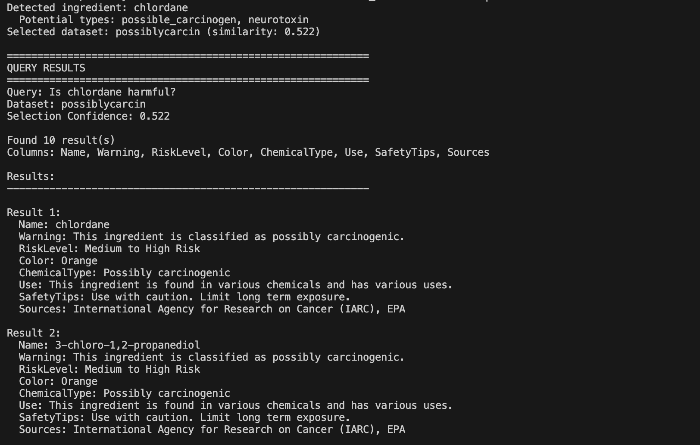
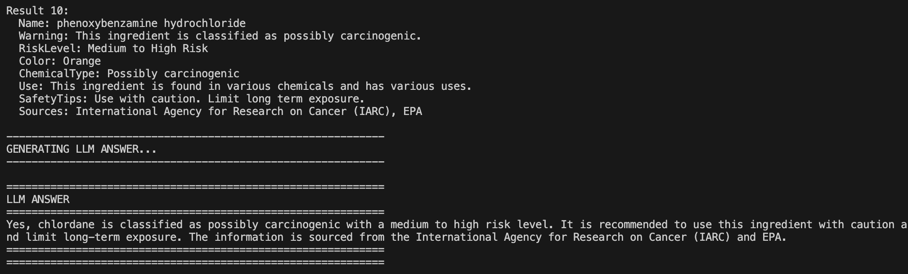

# EPA Natural Language Query System

A natural language query system for EPA (Environmental Protection Agency) datasets. This system allows you to query multiple JSON datasets using natural language, automatically selecting the most relevant dataset and extracting the requested ingredient information from the relevant dataset.

The relevant information is then connected to the original query with a reliable context.

## Flow Overview
```
Query (contains ingredient name)
    ↓
[Step 1] LLM Intent Classification → Extract ingredient name
    ↓
[Step 2] LLM Type Deduction → Deduce potential ingredient types
    ↓
[Step 3] Embedding → Create enriched embedding (ingredient + types)
    ↓
[Step 4] Similarity Search → Match against dataset semantic descriptions (and context layer)
    ↓
[Step 5] Select dataset. Search for the ingredient in the dataset.
    ↓   
[Step 6] Use LLM to answer original query using relevant information about ingredient extracted from dataset.
```

## Sample Use Case

